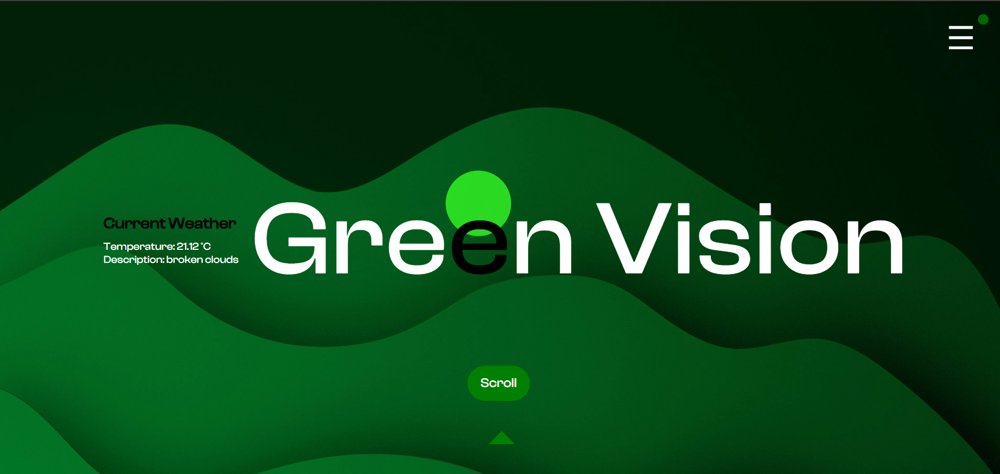

# Green Vision



Green Vision is a web application that [briefly describe the purpose of your project]. 

## Demo

You can see a live demo of Green Vision at the following link:

[Live Demo](https://sushanth-hebri.github.io/green-vision/)

## Installation

To run this project locally:

1. Clone the repository:
    ```bash
    git clone https://github.com/sushanth-hebri/green-vision.git
    ```

2. Open the `index.html` file in your web browser.

## License

This project is licensed under the MIT License.
